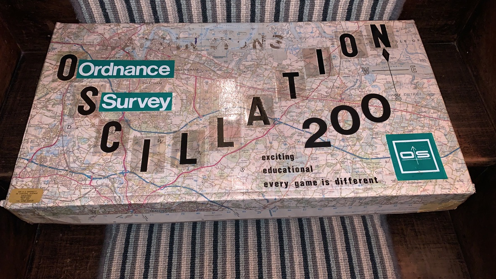
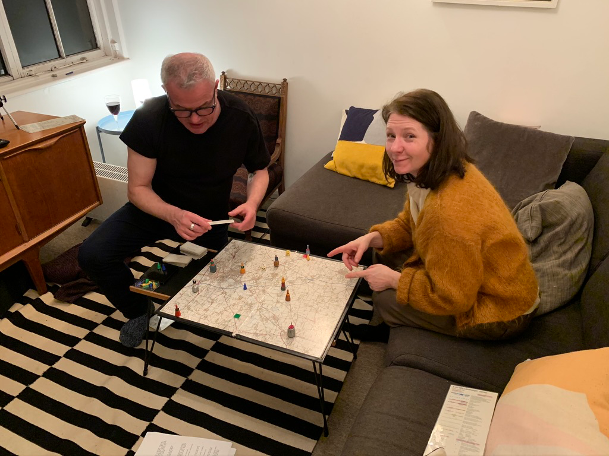
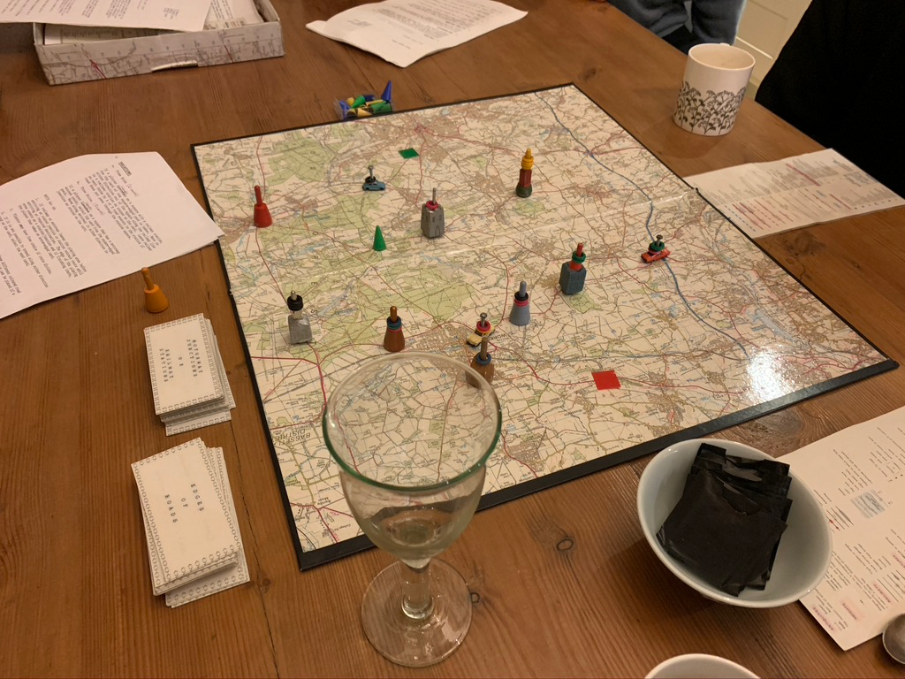
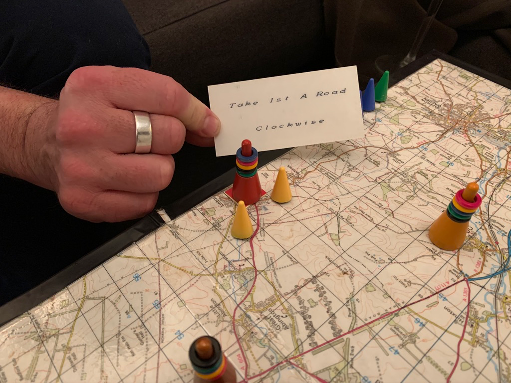
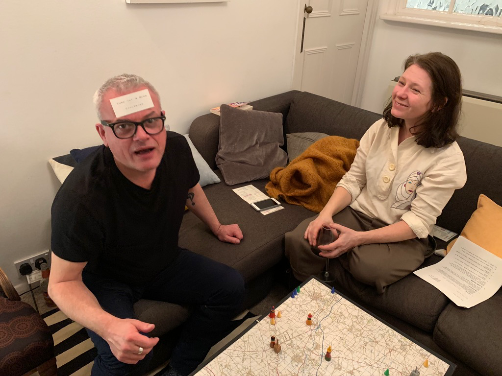
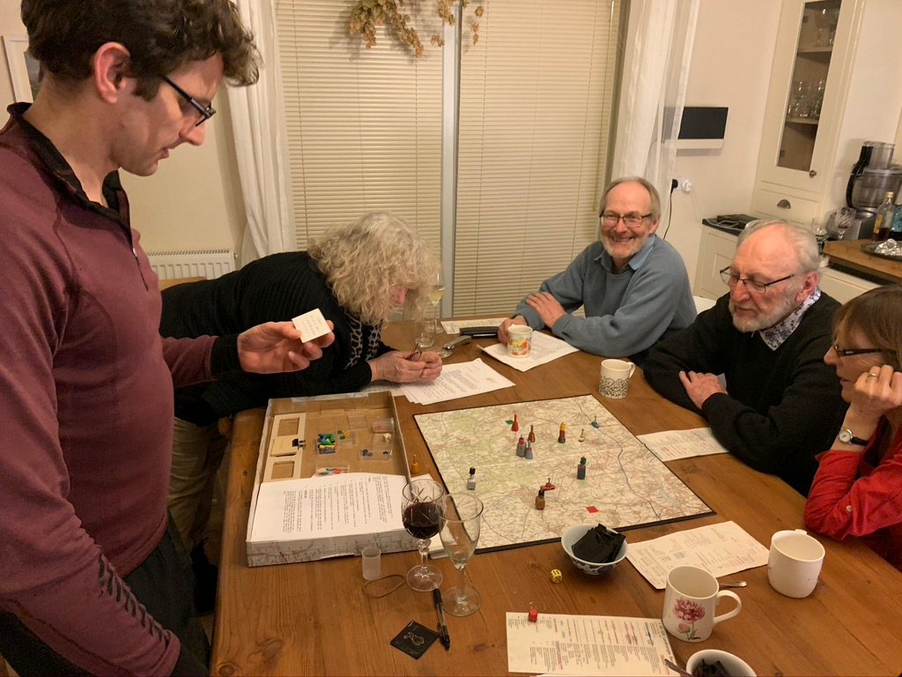
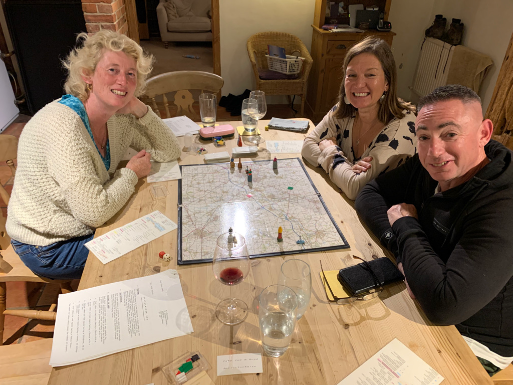
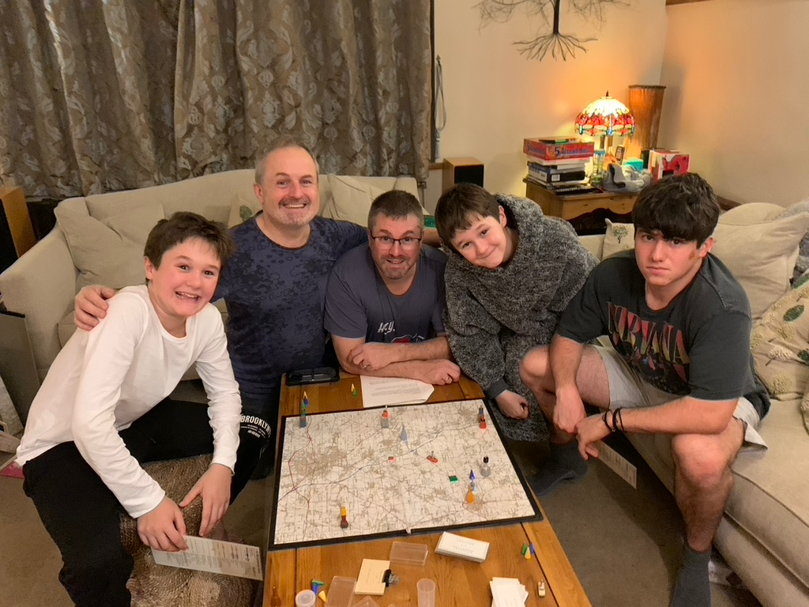

# OSCILLATION 
## Introduction

This game was created by my father, Kerry Barrett in the 1980 and early 90s. 
For all of Kerry's life, he was an employee of 
the Ordnance Survey as a surveyor, loved his job and all aspects of maps. 
He was convinced that inside every map, a fun and interesting game could be found, which when played could 
educate people about maps in the process. He spent several years designing the game and even had a meeting with [Waddingtons](https://en.wikipedia.org/wiki/Waddingtons), the 
game manufacturer to present his idea.
[Waddingtons](https://en.wikipedia.org/wiki/Waddingtons) thought that the game had potential but spotted a few limitations related 
to how cluttered the board became with game playing pieces. Also, sometimes the map was too small to see things properly and squares on 
the map got cluttered when multiple players got close to each other.
They asked Kerry to come up with some alternative ideas but this was the last meeting he had with a games manufacturer, 
as he fell ill and later died in 2012. 
Only one prototype was ever made and it has been played by family members and friends on many occasions. You can see some photos from recent years below.
Over Christmas period of 2023, I decided to create a digital version of the game as a tribute to my father and to see if I could overcome the limitations that Waddingtons had identified.

## Game Demo
There's a demo of the game so far running at https://oscillation.fly.dev/. Note that the game is still in development and is not yet complete, so please don't expect all features in the instructions to be found! 

## Pictures of the prototype game being played
### Guy and Lynds play in 2020

### The board in play

### Edge of roads card

### Guy wins the game!

### Game with friends 2020

### Denise Rachel and Stuart play in 2021

### The younger family play! Christmas 2023

## Technology Stack (T3 Stack)

The game is built with the [T3 Stack](https://create.t3.gg/):

* **Next.js 15** - React framework with App Router
* **tRPC** - End-to-end typesafe APIs
* **Prisma** - Type-safe ORM with PostgreSQL (Neon)
* **Zustand** - Lightweight state management
* **Material UI** - Component library
* **React-Leaflet** - Mapping component
* **OS Maps API** - Mapping provider and data source
* **TypeScript** - Full-stack type safety
* **Fly.io** - Deployment platform (London & Johannesburg regions)
 

## Oscillation Game instructions
1. THE GAME
    * Oscillation opens up a new dimension in board games as the players contribute in determining the positions of the
      Start finish objectives, which can be varied to give differing lengths of game.
    * With so many combinations available it is unlikely that any two games are identical.
    * The rules can apply to any defined area of a 1:50,000 Ordnance Survey map.

2. THE OBJECTIVE
    * Each player selects a Collector Car which can move through the grid squares according to the total shown by the
      two dice, and the aim is to collect five different coloured tokens from the Staging Posts.

3. TO START THE GAME.
    * Each player is issued with a sheet of map symbols for reference.
    * Players throw the dice to decide who is first to place a staging post. Others following in clockwise order.
      Highest
      throw places a staging post with:
        1. Pink tokens on road square having a Church with a Tower.
        2. Black tokens on road square having a Church with a Spire.
        3. Yellow tokens on road square having a Telephone, AA or RAC Box.
        4. Green tokens on road square having a School, or College (Sch: Co11).
        5. Blue tokens on road square having a Public House.

    * The number of tokens should equal the number of players.
    * Select the Starting Point by placing a green sticker on a square that has a crossroads of permitted roads.
    * Select the Finishing Point by placing a red sticker on a square about mid-way between junctions. The next player
      throws the dice and moves his Collector Car from the Starting Point.

4. RULES
    1. A and B roads only are used (Exceptions see 6.)
    2. Any square which contains road colouring counts in the total thrown.
    3. It is not possible to move diagonally.
    4. Routes taken must be driveable i.e. no jumping to another road passing through a square.
    5. Only one player can occupy a square - it may not be possible to use all of a dice throw if obstructed by other
       players.
    6. It is possible to overtake counting the occupied squares).
    7. Moves must be in one direction on a throw unless the road is a cul-de-sac.
    8. Tunnels or ferries can be used counting squares.
    9. During the game, the collector cars may pass through the start and Staging Posts (but not occupy) any number of
       times which count as one square.
    10. Tokens may only be collected if not already in possession of the player.

5. PLAYING AREA

    * It is possible to move from a road that leaves the board to another road on the perimeter in the following way:
        * Stop at the edge of the Playing Area and turn over the top card of the arrow-edged pack and move around edge
          of playing area as directed.
        * Unused dice throws are used to progress into the playing area. On the next throw only it is not permitted to
          retrace route to edge of playing

6. VARIATIONS

   a. Free Ride (2 cards)
    * If a player lands on a square with a railway station, the top card of the square-edged pack is taken.
      Move in either direction out of the square along the railway line to a railway station as stated on the card.
      Leave railway on next throw by A or B road nearest to the station if road does not pass through the station
      square.
    
   b. Free Drive. (2 cards)
    * If a player lands on a square that has a motorway access point, select the top card from the square-edged pack.
    * Move along motorway in either direction to junction as stated on the card.
      NOTES
    * If railway or motorway leaves the playing area before arriving at stated junction or station, retrace route until
      arriving at required destination.
      The edge of the playing area counts as a station/junction and if finishing there, the player then takes an
      arrow-edged card.
    * Players may have free choice if route divides.
    * If it is not possible to travel along either direction stated on the card, select the next card.

7. OBSTRUCTIONS
    * Each player is issued with three different coloured road obstructions blocking the route which can be placed if a
      double 1, 2, 3 or 4 is thrown.
        * Blue - placed where a double-sided river or canal crosses an A or B road.
        * Yellow - Placed where an electricity line or county or district boundary crosses an A or B road
        * Green - placed on a square with a railway bridge with an A or B road except squares with railway stations or
          motorway junctions.
    * A double 5 or 6 entitles the player to remove an obstruction which can then be re-used. If a player cannot place
      or remove an obstruction as required, the player can have second throw of the dice, counting the total of the four
      for their move.

8. TOKENS (optional)
    * Besides collecting tokens by passing through a Staging Post, it is possible to take the top token from other
      players
      by leap-frogging.
    * However, the disadvantaged player can redeem his token AND the next one on his next turn only. If any leap-frogged
      player has no token to lose, they miss their next throw.
    * The extra token must be returned to the Staging Post as soon as the fifth token is collected by removing it by
      hand, leaving that player one more to visit and collect to make a set.

9. Winning the game
   * The gets back to the Finishing Point with five different tokens is the Winner

## Development

### Prerequisites
- Node.js 20+
- pnpm 9+
- PostgreSQL (or use Neon free tier)

### Setup

```bash
# Install dependencies
pnpm install

# Set up environment variables
cp .env.example .env
# Edit .env with your PostgreSQL connection string and OS Maps API keys

# Generate Prisma client
pnpm run db:generate

# Run development server
pnpm run dev
```

### Environment Variables

Required environment variables:
- `DATABASE_URL` - PostgreSQL connection string (Neon recommended)
- `OS_MAPS_API_KEY` - OS Maps API key
- `OS_MAPS_API_SECRET` - OS Maps API secret

## Deployment

The app deploys automatically to Fly.io on push to main. The deployment includes:
- Validation (lint, type check, build)
- Docker-based deployment
- Health check verification

Machines are deployed in:
- **lhr** - London, UK
- **jnb** - Johannesburg, South Africa

### Manual deployment

```bash
# Install Fly CLI
curl -L https://fly.io/install.sh | sh

# Login
fly auth login

# Set secrets (first time only)
fly secrets set DATABASE_URL=...
fly secrets set OS_MAPS_API_KEY=...
fly secrets set OS_MAPS_API_SECRET=...

# Deploy
fly deploy
```
